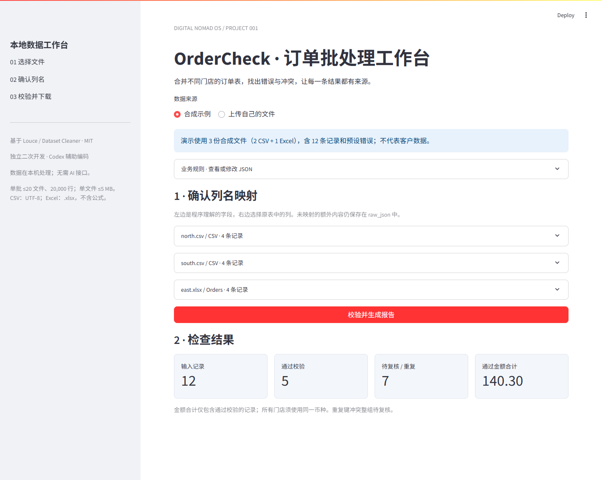

# OrderCheck · 订单批处理工作台

基于 [Dataset Cleaner](https://github.com/Louce/dataset-cleaner-and-analyser-tools) 的 **MIT 开源二次开发项目**。新增可追溯的订单批量验收流程，由 Codex 辅助开发；原许可证和固定来源版本记录保留。

## 解决什么问题

多门店导出的表格列名不同、重复订单内容冲突、日期或金额有误，手工合并很难知道哪些记录可靠。OrderCheck 接收 CSV 和 Excel，按明确规则处理，输出通过数据、待复核记录和完整来源。它是可运行的软件，不是一次性的文件整理服务。

## 实际界面与 Demo

[异常复核截图](docs/demo-review.png) · [中文项目讲解](PROJECT_EXPLAINED_FOR_ME.md) · [测试报告](TEST_REPORT.md)

内置 3 份**合成**文件：2 个 CSV + 1 个运行时生成的 Excel，共 12 条记录。实测 5 条通过，7 条需复核/重复（4 条无效、2 条冲突、1 条完全重复），通过金额合计 140.30。不是客户数据或商业成果。

## 新增功能

- 多文件、多工作表输入；自动建议列名映射，可手动确认。
- JSON 配置别名、必填字段、重复键、日期格式和金额范围。
- 严格日期检查、Decimal 金额处理；订单号以文本保留前导零。
- 跨文件完全重复识别；同键不同内容整组隔离，避免随意保留一个版本。
- 每行保存文件名、工作表、原记录号与原始字段 JSON；未映射字段也保留在 JSON。
- 清洁数据、异常理由、单元格变更、规则、映射和输入文件 SHA-256 一起导出。
- ZIP 报告包与 7 工作表 Excel；CSV 公式前缀防护，Excel 按字符串导出。
- 中文本地界面和 CLI；输入/规则/映射变化后自动隐藏旧报告。
- 51 项自动化测试，以及实际 Edge 上传、校验、下载流程检查。

## 本机直接使用

本项目运行环境已准备好。在文件夹中双击 **start-ordercheck.cmd**，保持窗口打开，然后访问 http://127.0.0.1:8501 。

如果该地址已经打开了本项目，就直接使用现有页面，不要重复启动。关闭启动窗口即可停止该窗口启动的服务。

选择“合成示例”→展开文件核对列名→点击“校验并生成报告”→切换结果标签→下载报告。上传自己的数据前，建议复制一份原文件留作备份。

## 在另一台电脑安装

已测试：Windows + Python 3.12.14。其他平台未实测。先安装 Python 3.12，在此仓库文件夹打开终端并执行：

~~~powershell
py -3.12 -m venv .venv
.\.venv\Scripts\python.exe -m pip install -r requirements-lock.txt
.\.venv\Scripts\python.exe -m streamlit run src/ordercheck_app.py --server.address 127.0.0.1 --server.port 8501 --browser.gatherUsageStats false
~~~

requirements-lock.txt 锁定本次实测的全部依赖；requirements-ordercheck.txt 记录直接依赖。上游原 requirements/ 保留，但新工作台优先用这套实测环境。首次安装需要联网下载依赖，处理数据无需外部 AI/API 或数据库。

## 输入与规则

默认标准字段：order_id（订单号）、store（门店）、date（日期）、amount（金额）。四者均必填。重复键是 store + order_id；所有文件须使用同一币种。

支持 UTF-8（可带 BOM）的 CSV，分隔符自动识别逗号、分号、Tab、竖线；支持 .xlsx 的所有工作表。表头必须在第一行且唯一。文件损坏、缺必需映射、空表或列数不一致会阻止整个批次，避免漏文件后仍报告成功。业务值错误则进入待复核表。

默认日期接受 YYYY-MM-DD / YYYY/MM/DD；可配置日月顺序，但若两种格式对应不同日期则拒绝猜测。金额接受非负数字和小数点，最多两位小数；不自动识别货币符号或千位分隔符。默认金额范围 0–10,000,000。

订单号原本存为文本时可保留 001；如果 Excel 早已把 001 存成数值 1，本程序不能恢复丢失的零。Excel 公式必须先另存为值；不执行公式，也不依赖缓存计算值。

单批 ≤20 文件、50 工作表、20,000 条记录；单文件 ≤5 MB，单 Excel ≤20 工作表、解压后 ≤25 MB；每表 ≤100 列。以上为保护性限制，不是性能承诺。CSV source_row 是包含表头的逻辑记录号（带换行的引号字段仍算一条），Excel 为工作表行号。

raw_json 是原始字段的文本表示，不是原文件字节备份；原文件仍应保留。通过表保留四个标准业务字段和来源，额外列在 raw_json 中。归一化后四字段相同才判完全重复，额外字段不参加重复签名，但重复行的原始内容保留在 rejected。

## 命令行批处理

~~~powershell
.\.venv\Scripts\python.exe src/ordercheck_cli.py --demo --output outputs/demo-report.zip
.\.venv\Scripts\python.exe src/ordercheck_cli.py --input a.csv b.xlsx --rules config/orders.json --output outputs/run-001.zip
~~~

输出必须使用新文件名，程序不覆盖现有文件。退出码：0=全部通过；2=报告已生成但有记录待复核；1=输入、配置或写入失败。示例包含故意设置的错误，因此返回 2 属于预期。

可把报告 manifest.json 的 mappings 对象另存为 JSON，再用 --mappings mappings.json 重放手动映射。报告保存 rules.json、manifest.json 和文件摘要；相同输入内容、顺序、规则与映射产生相同业务结果。ZIP 内部时间元数据可能不同，不保证压缩包逐字节一致。

## 报告内容

ZIP：report.xlsx、accepted.csv、rejected.csv、changes.csv、summary.json、rules.json、manifest.json。

Excel 工作表：accepted、rejected、changes、summary、inputs、rules、mappings。所有金额合计只计算 accepted。CSV 对以 = + - @ 开头的文本添加单引号，避免表格软件执行；程序内原值、Excel 文本和 raw_json 可用于对照。若需保留订单号文本格式，优先使用 Excel 报告，或通过“导入 CSV”指定文本类型。

## 技术栈与结构

Python、pandas、openpyxl、Streamlit、Decimal、pytest；上游清洗与可视化依赖 SciPy、scikit-learn、Plotly。

~~~text
src/
  data_cleaning.py       上游 DataCleaner + 新增 validate_order_batch
  app.py                保留的上游通用单表界面
  data_visualization.py 上游可视化
  utils.py              上游辅助工具
  order_rules.py        新增规则、标准化、冲突隔离
  order_batch.py        新增输入、映射、批处理与导出
  ordercheck_app.py     新增中文工作台
  ordercheck_cli.py     新增命令行入口
  order_demo.py         合成演示数据加载器
config/                 业务规则
examples/               合成数据
tests/                  原版回归、业务、导出、界面与 CLI 测试
docs/                   实际运行截图
scripts/browser_smoke.cjs 实际浏览器检查
outputs/                本机生成报告，Git 忽略
~~~

## 上游保留与改造方式

保留上游单表清洗、可视化、原界面和 MIT LICENSE。订单模式接入 DataCleaner 的原始/工作数据与变更历史，在原类新增 validate_order_batch；批处理调用该方法并复用上游质量信息工具。业务校验、批量 I/O、配置、审计报告、中文界面和 CLI 为新增。

这是对原项目工作流的扩展：不使用上游的统计填补去猜测业务订单。上游原功能仍可用以下命令启动，其全部边角功能不在本次验收范围：

~~~powershell
.\.venv\Scripts\python.exe -m streamlit run src/app.py --server.address 127.0.0.1 --server.port 8502 --browser.gatherUsageStats false
~~~

[UPSTREAM.md](UPSTREAM.md) 记录上游仓库和固定提交。当前 GitHub 仓库采用直接发布的完整代码快照，不是 Fork。本项目不声称上游代码为个人原创，也不复用上游任何商业或性能宣传作为自身成果。

## 测试与限制

~~~powershell
.\.venv\Scripts\python.exe -m pytest tests -q
.\.venv\Scripts\python.exe -m pip check
~~~

51 项测试通过（见 TEST_REPORT.md），另有真实浏览器检查。核心覆盖混合格式、多工作表、前导零、金额与日期、重复冲突、坏文件、映射、导出和重复执行。浏览器测试是可选开发工具：安装 Node.js 的 playwright 包并准备 Edge，启动本地页面后运行 node scripts/browser_smoke.cjs。

首版是本地小批量验收工具，未做大规模性能压测；不支持旧 .xls、GBK 自动转码、宏、公式计算、跨币种汇总、账号系统和在线多人服务。没有商业客户、收入或真实用户数量。数据结果由人复核后再用于实际业务。

## License

[MIT License](LICENSE)。原许可证声明保留，OrderCheck 新增部分同样按 MIT 提供。
